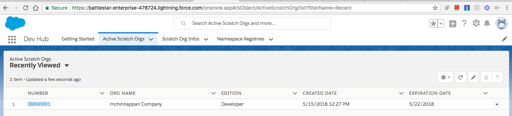
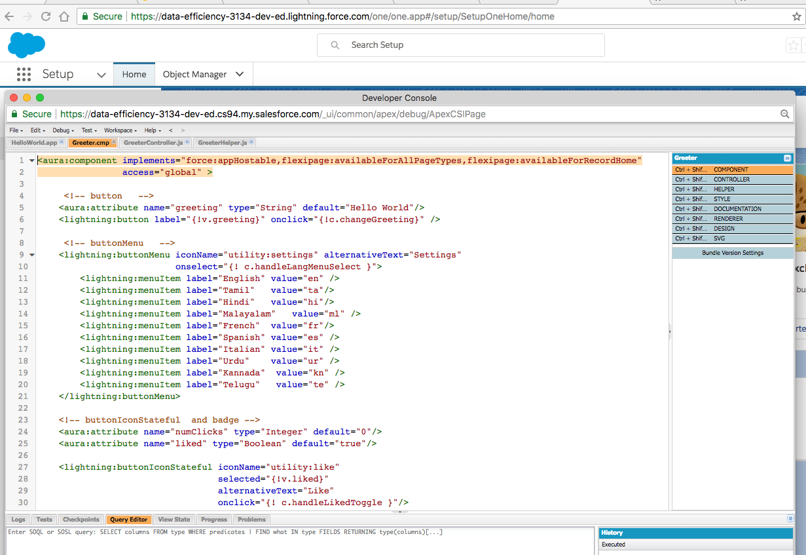
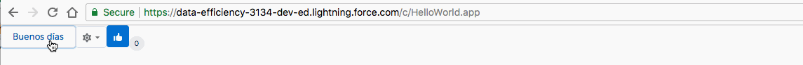
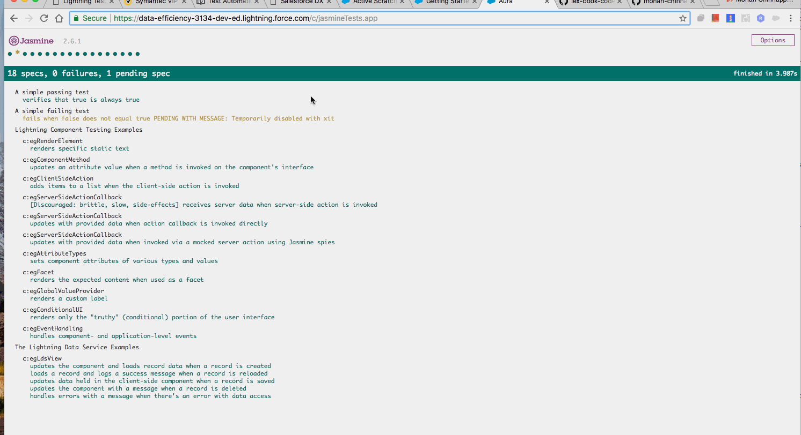
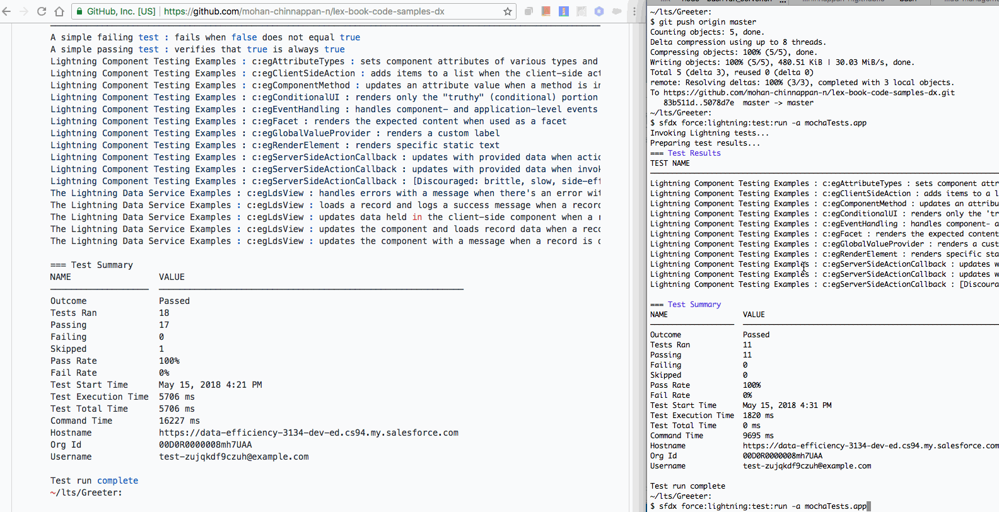
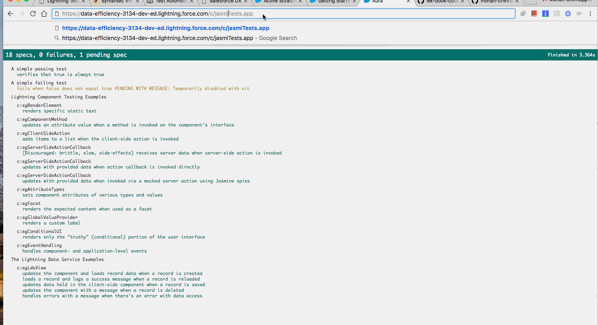

# SFDX  App creation with SFDX


```bash
$ cd lts
~/lts:

$ sfdx update
sfdx-cli: Updating CLI from 6.12.0-8b887b22cc to 6.15.0-ded9afdffb... ! finishing up

$ sfdx --version
sfdx-cli/6.15.0-ded9afdffb (darwin-x64) node-v8.9.4


## get a DevHub 30 days org :
open https://developer.salesforce.com/promotions/orgs/dx-signup

# login into DebHub
$  sfdx force:auth:web:login 
Successfully authorized mohan.chinnappan.dh101@gmail.com with org ID 00Df4000003l2kBEAQ
You may now close the browser

$  sfdx force:org:list
=== Orgs
     ALIAS   USERNAME                              ORG ID              CONNECTED STATUS
───  ──────  ────────────────────────────────────  ──────────────────  ─────────────────
             mohan.chinnappan.dh101@gmail.com      00Df4000003l2kBEAQ  Connected
             mohan.chinnappan.n23@gmail.com        00Df40000003eOAEAY  Connected
(D)  DevHub  mohan.chinnappan.dh_03@gmail.com      00D6A000002HthdUAC  invalid_grant


No active scratch orgs found. Specify --all to see all scratch orgs

## Create a project: Greeter
~/lts:

$  sfdx force:project:create -n Greeter
target dir = /Users/mchinnappan/lts
   create Greeter/sfdx-project.json
   create Greeter/README.md
   create Greeter/.forceignore
   create Greeter/config/project-scratch-def.json

~/lts:
$ cat Greeter/sfdx-project.json 
{
  "packageDirectories": [
    {
      "path": "force-app",
      "default": true
    }
  ],
  "namespace": "",
  "sfdcLoginUrl": "https://login.salesforce.com",
  "sourceApiVersion": "42.0"
}
~/lts:

$ cat Greeter/config/project-scratch-def.json 
{
    "orgName": "mchinnappan Company",
    "edition": "Developer",
    "orgPreferences" : {
        "enabled": ["S1DesktopEnabled"]
    }
}
~/lts:

## Alias your DebHub as DevHub101:
$  sfdx force:auth:web:login -d -a DevHub101
Successfully authorized mohan.chinnappan.dh101@gmail.com with org ID 00Df4000003l2kBEAQ
You may now close the browser

$  sfdx force:org:list
    
=== Orgs
     ALIAS      USERNAME                              ORG ID              CONNECTED STATUS
───  ─────────  ────────────────────────────────────  ──────────────────  ─────────────────
                mohan.chinnappan.n23@gmail.com        00Df40000003eOAEAY  Connected
(D)  DevHub101  mohan.chinnappan.dh101@gmail.com      00Df4000003l2kBEAQ  Connected


No active scratch orgs found. Specify --all to see all scratch orgs

## view the limits of the DebHub101:
$ sfdx force:limits:api:display -u DevHub101
NAME                                   REMAINING  MAXIMUM
─────────────────────────────────────  ─────────  ─────────
ActiveScratchOrgs                      20         20
ConcurrentAsyncGetReportInstances      200        200
ConcurrentSyncReportRuns               20         20
DailyApiRequests                       14994      15000
DailyAsyncApexExecutions               250000     250000
DailyBulkApiRequests                   10000      10000
DailyDurableGenericStreamingApiEvents  200000     200000
DailyDurableStreamingApiEvents         200000     200000
DailyGenericStreamingApiEvents         10000      10000
DailyScratchOrgs                       40         40
DailyStreamingApiEvents                200000     200000
DailyWorkflowEmails                    150        150
DataStorageMB                          1073       1073
DurableStreamingApiConcurrentClients   999        1000
FileStorageMB                          1073       1073
HourlyAsyncReportRuns                  1200       1200
HourlyDashboardRefreshes               200        200
HourlyDashboardResults                 5000       5000
HourlyDashboardStatuses                999999999  999999999
HourlyODataCallout                     10000      10000
HourlySyncReportRuns                   500        500
HourlyTimeBasedWorkflow                50         50
MassEmail                              10         10
PermissionSets                         1499       1500
SingleEmail                            15         15
StreamingApiConcurrentClients          1000       1000

# Move to the Greeter project folder
$ cd Greeter/

~/lts/Greeter:
## Create Scarth Org GreeterSORG1 for the development

$ sfdx force:org:create -s -f config/project-scratch-def.json -a GreeterSORG1
Successfully created scratch org: 00D0R0000008mh7UAA, username: test-zujqkdf9czuh@example.com
~/lts/Greeter:

## The scratch org GreeterSORG1 should be in the org:list
$  sfdx force:org:list
=== Orgs
     ALIAS      USERNAME                              ORG ID              CONNECTED STATUS
───  ─────────  ────────────────────────────────────  ──────────────────  ─────────────────
                mohan.chinnappan.n23@gmail.com        00Df40000003eOAEAY  Connected
(D)  DevHub101  mohan.chinnappan.dh101@gmail.com      00Df4000003l2kBEAQ  Connected


     ALIAS         SCRATCH ORG NAME     USERNAME                       ORG ID              EXPIRATION DATE
───  ────────────  ───────────────────  ─────────────────────────────  ──────────────────  ───────────────
(U)  GreeterSORG1  mchinnappan Company  test-zujqkdf9czuh@example.com  00D0R0000008mh7UAA  2018-05-22


~/lts/Greeter:

$ ls
README.md		config			force-app		sfdx-project.json
~/lts/Greeter:

## Create a LEX component : Greeter
$ sfdx force:lightning:component:create -n Greeter -d force-app/main/default/aura/
target dir = /Users/mchinnappan/lts/Greeter/force-app/main/default/aura
   create Greeter/Greeter.cmp
   create Greeter/Greeter.cmp-meta.xml
   create Greeter/GreeterController.js
   create Greeter/GreeterHelper.js
   create Greeter/Greeter.css
   create Greeter/GreeterRenderer.js
   create Greeter/Greeter.svg
   create Greeter/Greeter.auradoc
   create Greeter/Greeter.design

## Push this component bundle into Scratch Org: GreeterSORG1
$ sfdx force:source:push
=== Pushed Source
STATE  FULL NAME                     TYPE                  PROJECT PATH
─────  ────────────────────────────  ────────────────────  ────────────────────────────────────────────────────────
Add    Greeter/Greeter.auradoc       AuraDefinitionBundle  force-app/main/default/aura/Greeter/Greeter.auradoc
Add    Greeter/Greeter.cmp           AuraDefinitionBundle  force-app/main/default/aura/Greeter/Greeter.cmp
Add    Greeter/Greeter.cmp           AuraDefinitionBundle  force-app/main/default/aura/Greeter/Greeter.cmp-meta.xml
Add    Greeter/Greeter.css           AuraDefinitionBundle  force-app/main/default/aura/Greeter/Greeter.css
Add    Greeter/Greeter.design        AuraDefinitionBundle  force-app/main/default/aura/Greeter/Greeter.design
Add    Greeter/Greeter.svg           AuraDefinitionBundle  force-app/main/default/aura/Greeter/Greeter.svg
Add    Greeter/GreeterController.js  AuraDefinitionBundle  force-app/main/default/aura/Greeter/GreeterController.js
Add    Greeter/GreeterHelper.js      AuraDefinitionBundle  force-app/main/default/aura/Greeter/GreeterHelper.js
Add    Greeter/GreeterRenderer.js    AuraDefinitionBundle  force-app/main/default/aura/Greeter/GreeterRenderer.js
~/lts/Greeter:

## Open the GreeterSORG1 to see this component bundle: Greeter
$ sfdx force:org:open
Access org 00D0R0000008mh7UAA as user test-zujqkdf9czuh@example.com with the following URL: https://data-efficiency-3134-dev-ed.cs94.my.salesforce.com/secur/frontdoor.jsp?sid=00D0R0000008mh7!ARsAQHHHXlL_yr_F_8owTF8t6Gq1U9N6Y4qwfQyK9ImOLBWKz4VuO1zugVqWiNegUr4bAN8aBjBd8mcNt.IDmdxm5PI1.z49
~/lts/Greeter:

## Open VS Code for editing
$ code .

## Update Greeter.cmp and GreeterController.js and GreeterHelper.js as shown in this repo:
## https://github.com/mohan-chinnappan-n/lex-book-code-samples/tree/master/Greeter 

## Push the code into GreeterSORG1
$ sfdx force:source:push
=== Pushed Source
STATE    FULL NAME                     TYPE                  PROJECT PATH
───────  ────────────────────────────  ────────────────────  ────────────────────────────────────────────────────────
Changed  Greeter/Greeter.cmp           AuraDefinitionBundle  force-app/main/default/aura/Greeter/Greeter.cmp
Changed  Greeter/GreeterController.js  AuraDefinitionBundle  force-app/main/default/aura/Greeter/GreeterController.js
Changed  Greeter/GreeterHelper.js      AuraDefinitionBundle  force-app/main/default/aura/Greeter/GreeterHelper.js
~/lts/Greeter:

## Check this into Git Repo
$ git init
Initialized empty Git repository in /Users/mchinnappan/lts/Greeter/.git/
~/lts/Greeter:
$ git add -A
~/lts/Greeter:
$ git commit -m 'init'
[master (root-commit) cf1710d] init
 19 files changed, 5885 insertions(+)
 create mode 100644 .forceignore
 create mode 100644 .sfdx/orgs/test-zujqkdf9czuh@example.com/metadataTypeInfos.json
 create mode 100644 .sfdx/orgs/test-zujqkdf9czuh@example.com/sourcePathInfos.json
 create mode 100644 .sfdx/orgs/test-zujqkdf9czuh@example.com/sourcePathInfos.json.bak
 create mode 100644 .sfdx/sfdx-config.json
 create mode 100644 .sfdx/tools/apex.db
 create mode 100644 .vscode/settings.json
 create mode 100644 README.md
 create mode 100644 config/project-scratch-def.json
 create mode 100644 force-app/main/default/aura/Greeter/Greeter.auradoc
 create mode 100644 force-app/main/default/aura/Greeter/Greeter.cmp
 create mode 100644 force-app/main/default/aura/Greeter/Greeter.cmp-meta.xml
 create mode 100644 force-app/main/default/aura/Greeter/Greeter.css
 create mode 100644 force-app/main/default/aura/Greeter/Greeter.design
 create mode 100644 force-app/main/default/aura/Greeter/Greeter.svg
 create mode 100644 force-app/main/default/aura/Greeter/GreeterController.js
 create mode 100644 force-app/main/default/aura/Greeter/GreeterHelper.js
 create mode 100644 force-app/main/default/aura/Greeter/GreeterRenderer.js
 create mode 100644 sfdx-project.json

## pull the code App code  created  using UI
$ sfdx force:source:pull
=== Pulled Source
STATE  FULL NAME                  TYPE                  PROJECT PATH
─────  ─────────────────────────  ────────────────────  ──────────────────────────────────────────────────────────────
Add    HelloWorld/HelloWorld.app  AuraDefinitionBundle  force-app/main/default/aura/HelloWorld/HelloWorld.app-meta.xml
Add    HelloWorld/HelloWorld.app  AuraDefinitionBundle  force-app/main/default/aura/HelloWorld/HelloWorld.app


## install LTS
$ sfdx force:lightning:test:install
Waiting for the package install request to complete. Status = IN_PROGRESS
Waiting for the package install request to complete. Status = IN_PROGRESS
Waiting for the package install request to complete. Status = IN_PROGRESS
Successfully installed package [04tJ00000006jC9]


```
## DevHub101


## GreeterSORG1


## Demo



## Lightning Testing Service

```bash
$ sfdx force:lightning:test:run -a jasmineTests.app
Invoking Lightning tests...
Preparing test results...
=== Test Results
TEST NAME                                                                                                                                                                 OUTCOME  MESSAGE                             RUNTIME (MS)
────────────────────────────────────────────────────────────────────────────────────────────────────────────────────────────────────────────────────────────────────────  ───────  ──────────────────────────────────  ────────────
A simple failing test : fails when false does not equal true                                                                                                              Skip      # SKIP disabled by xit or similar
A simple passing test : verifies that true is always true                                                                                                                 Pass                                         23
Lightning Component Testing Examples : c:egAttributeTypes : sets component attributes of various types and values                                                         Pass                                         86
Lightning Component Testing Examples : c:egClientSideAction : adds items to a list when the client-side action is invoked                                                 Pass                                         132
Lightning Component Testing Examples : c:egComponentMethod : updates an attribute value when a method is invoked on the component's interface                             Pass                                         65
Lightning Component Testing Examples : c:egConditionalUI : renders only the "truthy" (conditional) portion of the user interface                                          Pass                                         72
Lightning Component Testing Examples : c:egEventHandling : handles component- and application-level events                                                                Pass                                         77
Lightning Component Testing Examples : c:egFacet : renders the expected content when used as a facet                                                                      Pass                                         73
Lightning Component Testing Examples : c:egGlobalValueProvider : renders a custom label                                                                                   Pass                                         67
Lightning Component Testing Examples : c:egRenderElement : renders specific static text                                                                                   Pass                                         69
Lightning Component Testing Examples : c:egServerSideActionCallback : updates with provided data when action callback is invoked directly                                 Pass                                         15
Lightning Component Testing Examples : c:egServerSideActionCallback : updates with provided data when invoked via a mocked server action using Jasmine spies              Pass                                         12
Lightning Component Testing Examples : c:egServerSideActionCallback : [Discouraged: brittle, slow, side-effects] receives server data when server-side action is invoked  Pass                                         242
The Lightning Data Service Examples : c:egLdsView : handles errors with a message when there's an error with data access                                                  Pass                                         384
The Lightning Data Service Examples : c:egLdsView : loads a record and logs a success message when a record is reloaded                                                   Pass                                         438
The Lightning Data Service Examples : c:egLdsView : updates data held in the client-side component when a record is saved                                                 Pass                                         754
The Lightning Data Service Examples : c:egLdsView : updates the component and loads record data when a record is created                                                  Pass                                         1909
The Lightning Data Service Examples : c:egLdsView : updates the component with a message when a record is deleted                                                         Pass                                         1278

=== Test Summary
NAME                 VALUE
───────────────────  ───────────────────────────────────────────────────────────
Outcome              Passed
Tests Ran            18
Passing              17
Failing              0
Skipped              1
Pass Rate            100%
Fail Rate            0%
Test Start Time      May 15, 2018 4:21 PM
Test Execution Time  5706 ms
Test Total Time      5706 ms
Command Time         16227 ms
Hostname             https://data-efficiency-3134-dev-ed.cs94.my.salesforce.com
Org Id               00D0R0000008mh7UAA
Username             test-zujqkdf9czuh@example.com

Test run complete
~/lts/Greeter:


```

### LTS UI - jasmine





### LTS UI - mocha




## Editing code with VS Code


